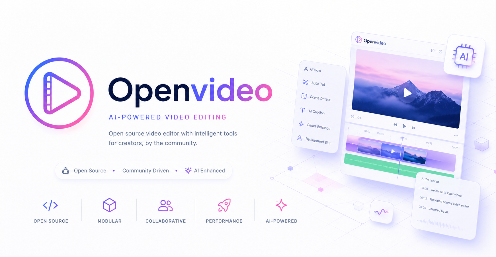

<p align="center">
  
</p>

<h1 align="center">OpenVideo</h1>

<p align="center">
  A local-first desktop studio for recording a selected window, organizing media, editing a timeline, and exporting an MP4—without uploading your project or media.
</p>

<p align="center">
  <a href="#quick-start">Quick start</a> ·
  <a href="#what-works-today">What works today</a> ·
  <a href="#local-first-by-design">Local-first</a> ·
  <a href="CONTRIBUTING.md">Contributing</a> ·
  <a href="SECURITY.md">Security</a>
</p>

<p align="center">
  <a href="LICENSE"></a>
  <a href="https://github.com/Theorvane/openvideo/actions"></a>
  <a href="https://github.com/Theorvane/openvideo/issues"></a>
</p>

> [!IMPORTANT]
> **MVP status.** OpenVideo is under active development. It runs from source today; it does **not** yet provide a packaged installer or auto-update service. The hero artwork is concept artwork and does not indicate that external AI-video features are available.

## What is OpenVideo?

OpenVideo is an open-source Electron application for creators who want a straightforward, private video workflow on their own machine. Select a desktop window, record it to a local WebM file, arrange local media in a timeline, review it in the Program Monitor, and render a local H.264/AAC MP4 using FFmpeg.

The application is deliberately local-first: no account, cloud upload, analytics, crash reporting, or provider network calls are part of the current product.

## What works today

| Surface | Current capability |
| --- | --- |
| **Selected-window recording** | Lists capturable desktop windows, grants capture only for the actively selected source, and saves incremental WebM recordings locally. |
| **Local projects and media** | Creates local projects, imports local assets, and keeps projects, assets, recordings, voice profiles, TTS output, and exports in local app storage. |
| **Timeline editing** | Adds tracks and clips; trim, split, delete, and adjust opacity, scale, position, rotation, volume, keyframes, transitions, and audio mix settings. |
| **Review** | Provides playhead movement and a best-effort Program Monitor for reviewing saved timeline state. |
| **Final export** | Renders a saved timeline locally to H.264 video and AAC audio in an MP4 container through a locally installed FFmpeg executable. |
| **Optional local narration** | Supports consent-based local voice profiles and user-configured `local_qwen` TTS jobs. No model or runtime is downloaded by OpenVideo. |

## Quick start

### Prerequisites

- Node.js 22 or newer
- npm 10 or newer
- FFmpeg for final MP4 export
- On macOS, Screen Recording permission for the terminal that runs OpenVideo or for the packaged app when one becomes available

### Install and run

```bash
git clone https://github.com/Theorvane/openvideo.git
cd openvideo
npm install
npm run dev
```

The first capture attempt on macOS can require a permission prompt or a relaunch after you grant access.

### Export an MP4

OpenVideo uses **your local FFmpeg executable**. Set an absolute executable path, or make `ffmpeg` discoverable through an absolute directory in `PATH`:

```bash
VIDEO_TOOL_FFMPEG_PATH=/absolute/path/to/ffmpeg npm run dev
```

Relative FFmpeg paths are rejected. If FFmpeg is unavailable, OpenVideo reports the local runtime issue and does not start an export job.

## A local editing workflow

1. **Choose a window** — refresh the available sources and select one desktop window.
2. **Record locally** — preview, record, pause, resume, and stop. The result is written as a local WebM file.
3. **Build a project** — create a project, import local media, and place assets on timeline tracks.
4. **Shape the edit** — trim, split, delete, adjust clip properties, and review the playhead in Program Monitor.
5. **Export locally** — save the timeline and render an MP4 with the local FFmpeg runtime.

Recordings are stored under Electron user data by default:

```text
<Electron userData>/recordings
```

For development, override that directory with an absolute path:

```bash
VIDEO_TOOL_RECORDINGS_DIR=/absolute/path/to/recordings npm run dev
```

## Local-first by design

OpenVideo separates Electron's main process, preload bridge, and React renderer. The renderer receives a narrow, typed `window.videoTool` API; raw `ipcRenderer`, local file paths, FFmpeg arguments, voice-sample paths, and export paths remain outside the renderer.

This boundary supports a few non-negotiables:

- **Your media stays on your device.** There is no cloud upload, hosted render queue, account system, analytics, crash reporting, or provider network call.
- **Capture is constrained.** The app grants access only to the selected desktop source.
- **Voice consent matters.** Local voice references must be yours or collected with permission, are stored locally, and can be deleted.
- **Final rendering stays local.** FFmpeg is the authoritative output path for supported saved timeline state.

## Optional local Qwen TTS

OpenVideo can start a `local_qwen` TTS job only after you configure a compatible local wrapper and model files yourself. This is an optional audio-asset workflow; it does not replace recording and it does not make external requests.

Read [the local Qwen voice-profile guide](docs/local-qwen-voice-profiles.md) and begin with [the safe configuration example](docs/local-qwen-tts-config.example.json). The configuration path and all filesystem paths used by the wrapper must be absolute:

```bash
VIDEO_TOOL_TTS_CONFIG_PATH=/absolute/path/to/local-qwen-tts.json npm run dev
```

## Current boundaries and planned seams

OpenVideo intentionally has a narrow MVP boundary.

| Available now | Not available now |
| --- | --- |
| Selected-window capture | Full-screen capture |
| Local WebM recordings | Microphone or system-audio mix in the selected-window recorder |
| Local projects, media, and timeline editing | Cloud sync, uploads, hosted rendering, accounts, analytics, crash reporting, or auto-update |
| Local H.264/AAC MP4 export | Multiple final export formats or frame-perfect/multitrack mastering guarantees |
| User-configured local Qwen TTS | Automatic model/runtime downloads or guaranteed wrapper compatibility |
| Provider interfaces in `src/shared/providerSeams.ts` | Gemini Veo, OpenAI Sora, ElevenLabs, or any other external AI provider integration |

Program Monitor is a best-effort review surface, not a frame-perfect final render. For supported saved timeline state, FFmpeg MP4 export is the authoritative local output.

## Verify from source

```bash
npm run typecheck
npm test
npm run build
```

`npm run build` compiles Electron main, preload, and renderer output into `out/`. It does not package an installer.

For end-to-end manual QA, run the app on macOS with Screen Recording permission, record one selected window, create a project with a local asset, make a small timeline edit, and export an MP4. Automated tests cannot grant the operating-system permission.

## Contribute

OpenVideo welcomes focused contributions that preserve its local-first and security boundaries.

1. Read [AGENTS.md](AGENTS.md) and search existing issues and pull requests.
2. Create or find a GitHub issue, update `dev`, and create a focused branch.
3. Add or update tests for behavior changes.
4. Run the checks above and open a pull request to `dev`.

See [CONTRIBUTING.md](CONTRIBUTING.md) for the workflow, [CODE_OF_CONDUCT.md](CODE_OF_CONDUCT.md) for participation expectations, [SUPPORT.md](SUPPORT.md) for help, and [SECURITY.md](SECURITY.md) for responsible disclosure guidance.

## License

OpenVideo is distributed under the [MIT License](LICENSE).
