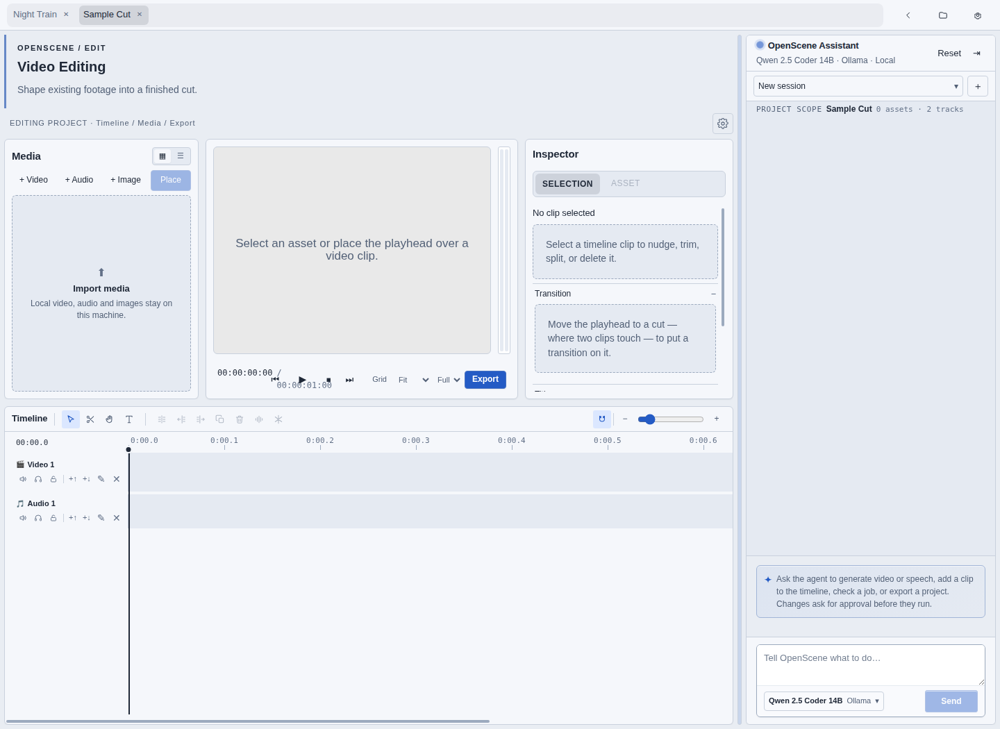
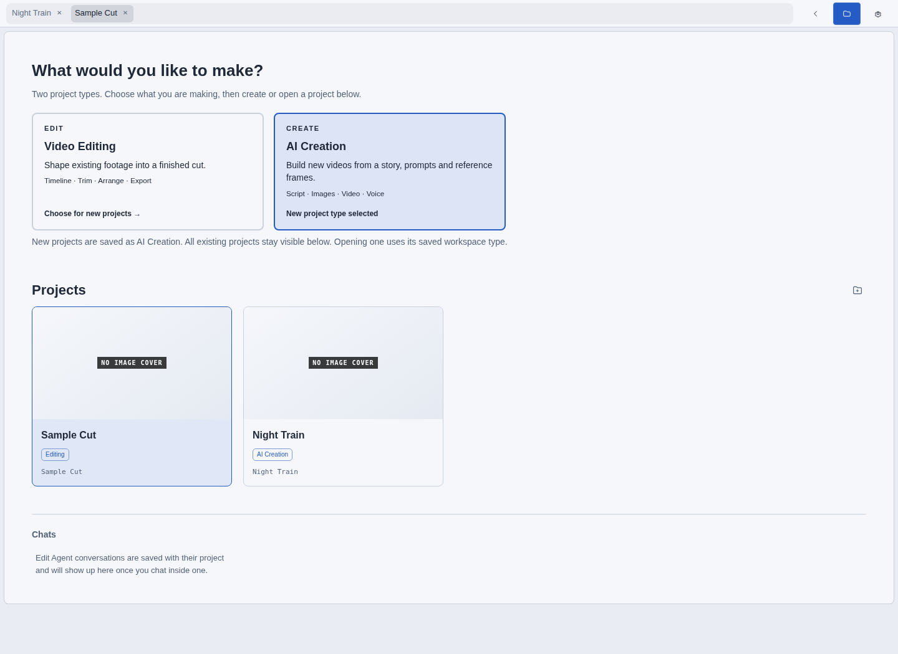
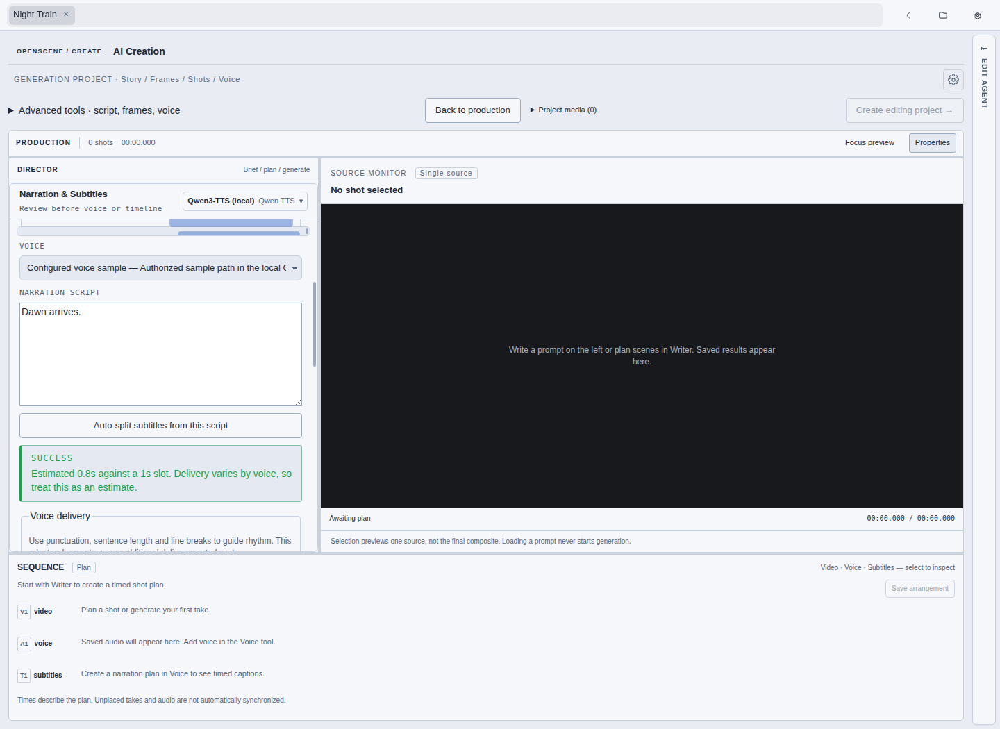
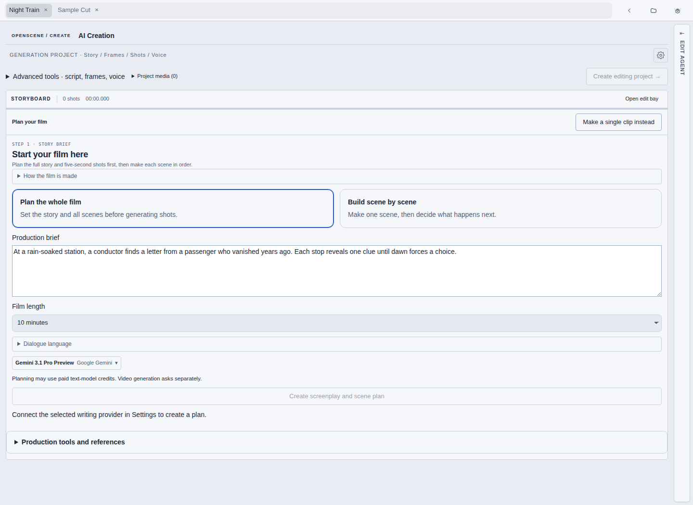

<p align="center">
  
</p>

<h1 align="center">OpenVideo</h1>

<p align="center">
  A local-first desktop video editor with an AI agent that can drive it — your media stays on your machine, and you choose which model providers, if any, it talks to.
</p>

<p align="center">
  <a href="#quick-start">Quick start</a> ·
  <a href="#the-workspace">The workspace</a> ·
  <a href="#the-edit-agent">Edit Agent</a> ·
  <a href="#providers-and-models">Providers</a> ·
  <a href="#where-your-data-lives">Your data</a> ·
  <a href="CONTRIBUTING.md">Contributing</a>
</p>

<p align="center">
  <a href="LICENSE"></a>
  <a href="https://github.com/Theorvane/openvideo/actions"></a>
  <a href="https://github.com/Theorvane/openvideo/issues"></a>
</p>

> [!IMPORTANT]
> **Pre-release.** OpenVideo runs from source. There is no packaged installer or auto-update yet. The hero and screenshots below show the real interface.

## What is OpenVideo?

OpenVideo is an open-source Electron app for editing video on your own machine. You open a folder as a project, put clips on a timeline, and export an MP4 with your local FFmpeg.

What makes it different is the **Edit Agent**: a chat panel that sits beside the timeline and can actually operate the editor — read the timeline, add and trim clips, generate voice or video, and start an export. It asks for approval before anything that changes your project.

Nothing is uploaded on its own. Model providers are opt-in, connected one at a time with your own API key or sign-in, and the app works with none of them connected.

## The workspace

Open a folder and you land in the workspace. One tab strip switches between editing and the two generation studios; the agent chat stays docked beside all three.



Projects and past conversations live on the start page. Picking a chat reopens its project and restores the transcript.



### Editing

- Import local media into a project folder and place it on video and audio tracks
- Trim, split, move, duplicate, and delete clips, with undo/redo
- Adjust opacity, scale, position, rotation, and volume, with keyframes, transitions, and per-track audio mix
- Review with a playhead and a best-effort Program Monitor
- Export H.264/AAC MP4 through your local FFmpeg
- Keyboard shortcuts throughout, remappable in Settings

### Voice generation

Write a script, pick a voice model, generate, and import the result straight into the project.



### Video generation

Prompt with a style, aspect ratio, and duration — and optionally a reference image to seed image-to-video.



## The Edit Agent

The chat panel is not a copilot that writes suggestions for you to apply. It calls the same operations the UI does, through a typed tool surface in the main process:

| The agent can | Tool |
| --- | --- |
| Read a project timeline and asset metadata | `getProjectTimeline` |
| Watch footage — sampled frames arrive as images it can actually see | `watchProjectVideo` |
| Place, trim, and restyle clips | `addClipToTimeline`, `trimTimelineClip`, `updateClipEffects` |
| Generate speech or video and follow the job | `createSpeechJob`, `createVideoJob`, `getJobStatus` |
| Import a finished generation into the project | `importGeneratedResult` |
| Start a local export | `exportProjectVideo` |

Anything that writes to your project or starts a job pauses for approval first. Read-only calls run immediately.

Conversations are kept per project as sessions: start a new one, switch back to an earlier one, or delete it. History is stored in a path-free `chats.json` inside the project folder.

## Providers and models

The provider and model registry is generated from a snapshot of the [models.dev](https://models.dev) catalog — roughly 150 providers and several thousand models — and is regenerated with `scripts/generateLlmCatalog.mjs`.

- **Local**: [Ollama](https://ollama.com) runs models on your machine with no key and no account.
- **Cloud chat**: connect a provider in *Settings → Providers* with an API key. Only connected providers' models appear in the pickers.
- **OpenAI**: two login methods on one provider — an API key, or a ChatGPT sign-in (PKCE OAuth) for the model set that backend serves. Tokens stay in main-process safe storage; the renderer only learns whether you are connected.
- **Generation**: ElevenLabs and OpenAI for speech; Google Veo and OpenAI Sora for video. Providers without a real adapter stay listed but honestly unavailable rather than pretending to work.

API keys are written to Electron `safeStorage` in the main process and never reach the renderer.

## Quick start

### Prerequisites

- Node.js 22+ and npm 10+
- FFmpeg, for MP4 export
- macOS: Screen Recording permission for the terminal running OpenVideo, if you use window capture

### Install and run

```bash
git clone https://github.com/Theorvane/openvideo.git
cd openvideo
npm install
npm run dev
```

OpenVideo uses **your** FFmpeg. Either make `ffmpeg` discoverable through an absolute directory on `PATH`, or point at it explicitly:

```bash
VIDEO_TOOL_FFMPEG_PATH=/absolute/path/to/ffmpeg npm run dev
```

Relative FFmpeg paths are rejected. Without a usable FFmpeg, OpenVideo reports the problem instead of starting an export.

### Try the agent without any cloud account

```bash
ollama pull qwen2.5-coder
ollama serve
```

Then pick the local model in the chat panel's model picker. Note that watching footage needs a vision-capable model.

## Where your data lives

Projects are folders you choose. Assets, chat history, and generated results are written inside them; app-managed projects and recordings live under Electron user data.

```bash
VIDEO_TOOL_RECORDINGS_DIR=/absolute/path/to/recordings npm run dev
```

The renderer talks to the main process through a narrow typed `window.videoTool` bridge. Raw `ipcRenderer`, filesystem paths, FFmpeg arguments, API keys, and OAuth tokens stay outside it — a picked reference image, for example, crosses as bytes, never as a path.

- **No account, no telemetry.** No analytics, crash reporting, or usage tracking.
- **No background network calls.** The app talks to a provider only when you ask it to, using a provider you connected.
- **Capture is scoped.** Window capture grants access to the single source you select.
- **Removable.** Projects can be removed from the list — a folder you chose is only unregistered, never deleted recursively — and conversations can be deleted.

## Current boundaries

| Works today | Not yet |
| --- | --- |
| Selected-window capture to local WebM | Full-screen capture; mic or system-audio mix in the recorder |
| Local projects, media, timeline editing, undo/redo | Cloud sync, hosted rendering, accounts, auto-update |
| Local H.264/AAC MP4 export | Other export formats; frame-perfect multitrack mastering guarantees |
| Agent-driven editing, generation, and export | Unattended operation — changes ask for approval |
| Veo image-to-video via a reference image | Sora reference images (needs a multipart upload path this build does not send) |

Program Monitor is a best-effort review surface. FFmpeg export is the authoritative output.

## Verify from source

```bash
npm run typecheck
npm test
npm run build
```

`npm run build` compiles main, preload, and renderer into `out/`. It does not package an installer.

Some behavior can only be checked by hand: OS permissions, real provider calls, and final render quality.

## Contribute

1. Read [AGENTS.md](AGENTS.md) and search existing issues and pull requests.
2. Create or find a GitHub issue, update `dev`, and branch as `<type>/<issue-number>-<description>`.
3. Add or update tests for behavior changes.
4. Run the checks above and open a pull request against `dev`.

See [CONTRIBUTING.md](CONTRIBUTING.md), [CODE_OF_CONDUCT.md](CODE_OF_CONDUCT.md), [SUPPORT.md](SUPPORT.md), and [SECURITY.md](SECURITY.md).

## License

[MIT](LICENSE)
